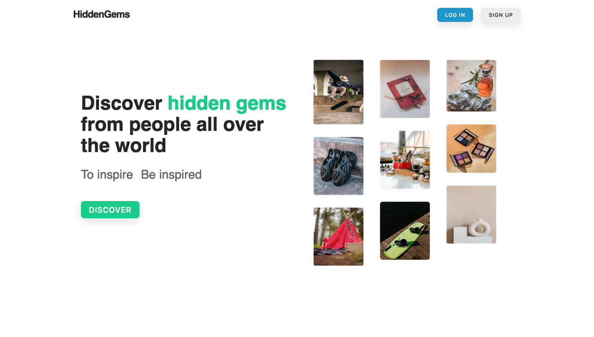
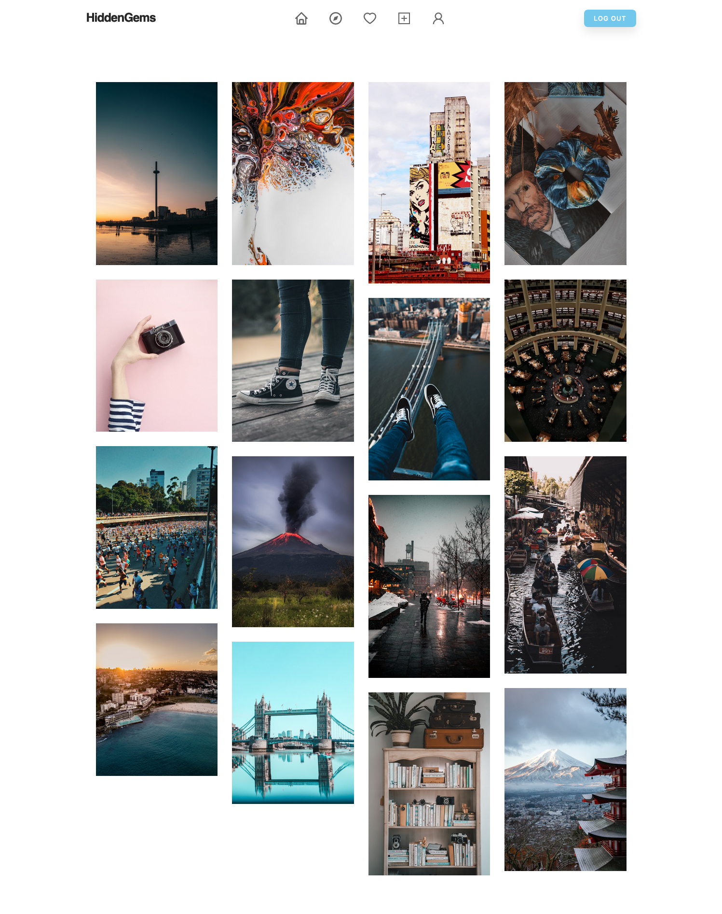
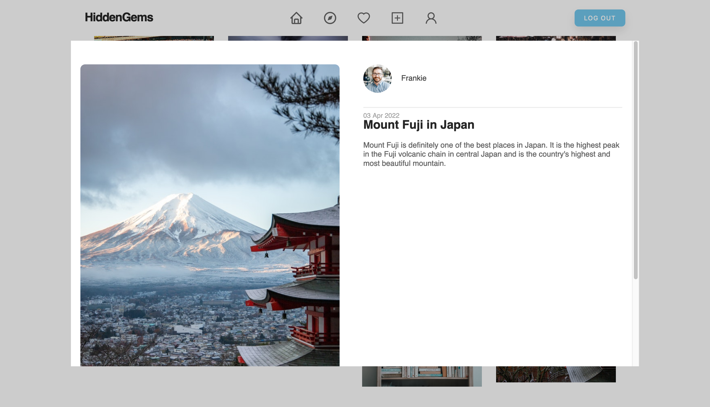
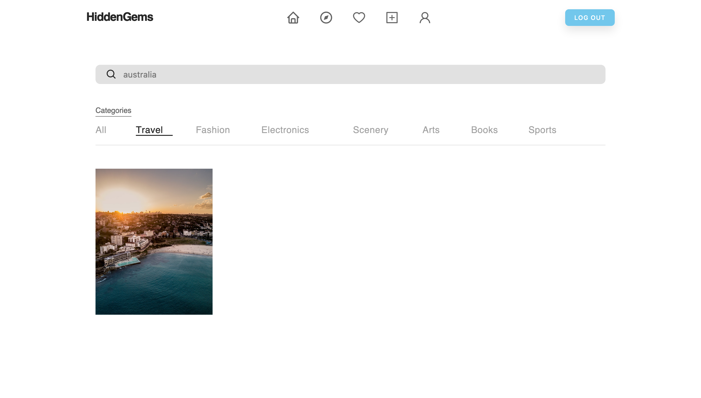
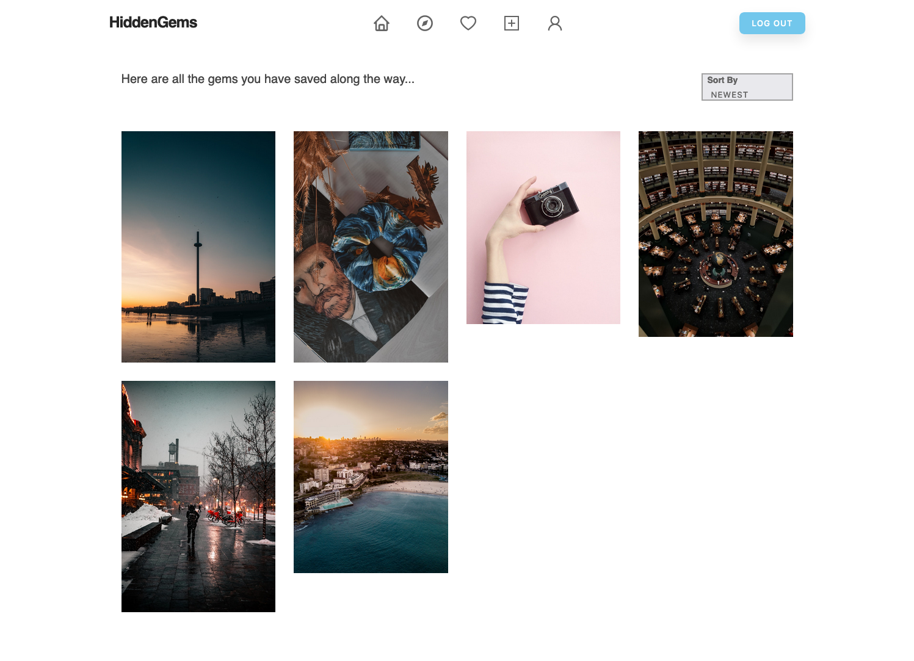
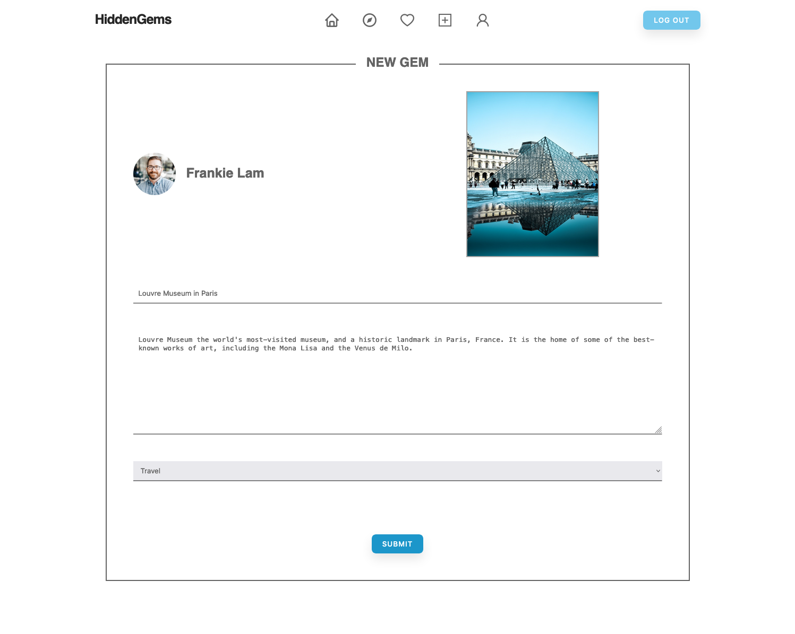
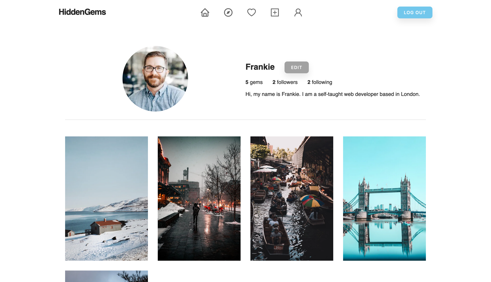
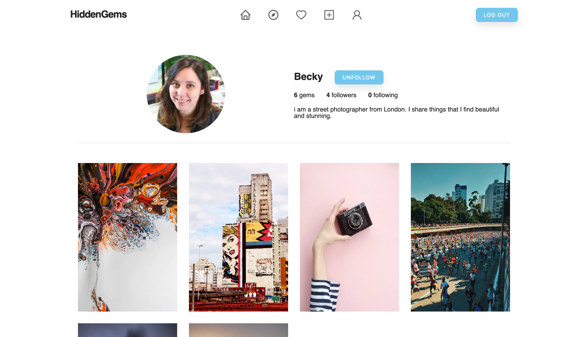
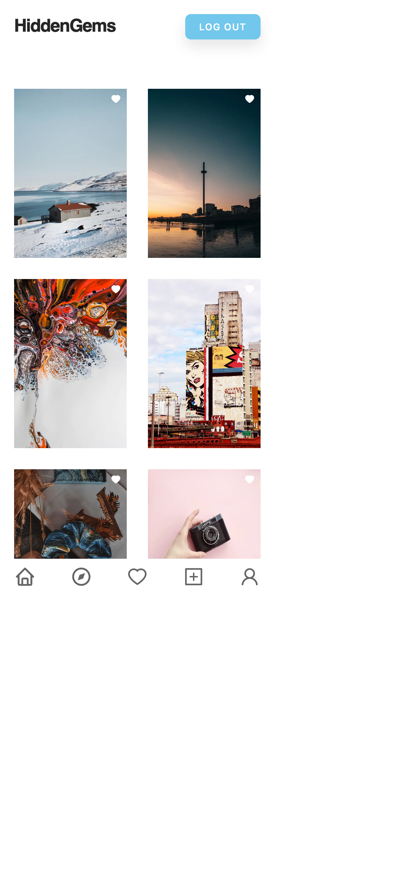

# NextJS App - Hidden Gems

This is my first NextJS app, a multiple-page application working as a social media platform where users can share their hidden gems. The app is built with fundamental featrues from React and NextJs, realtime database and authentication from Firebase, and mobile responsiveness.

## Table of contents

- [Overview](#overview)
  - [Project background](#project-background)
  - [Website structure](#website-structure)
  - [Screenshot](#screenshot)
  - [Links](#links)
- [My process](#my-process)
  - [Built with](#built-with)
  - [What I learned](#what-i-learned)
- [Author](#author)

## Overview

### Project background

The project is built as an pinterest and instagram-like social media platform where users share their hidden gems. The main purposes of building this project are to practise my understanding and skills of React and NextJs, and to give myself a hand-on experience of building a real-life project before my first web developer job.

### Website Structure

The website has 5 pages: Home, Explore, Collection, NewGem and Gemmer, and 1 common layout: navigation.

#### Home

HOME, a default page, has 2 main sections: hero and masonry. Either one of them is shown depending on whether users have logged in or not. Non-logged-in users are all redirected to HOME when visting other pages of the website through URL.

If users have not logged in, hero section will be shown to introduce what the app is all about and has a call-to-action button encouraging users to start discovering the app either by logging in an existing account or creating one.

If users are visiting the website with a valid token stored in cookie and authenticated by Firebase during server-side rendering, then masrony of gem posts will be displayed. Gem posts are, by default, sorted by newest.

#### Explore

EXPLORE allows users to explore gem posts with filters of search term and category. Only gem posts matching with their filtering criteria are shown. If there is none matching, then an instant feedback of "No items currently matching the criteria" will appear to notify users.

#### Collection

COLLECTION is where users can see all the gems posts they have saved up. By default, gem posts are sorted by newest, but users could switch it to category where posts are sorted by alphabetical order of category name.

#### NewGem

NEWGEM provides a form where users can create a new gem post with input fields of image, title, description and category. Once a new gem post is submitted, then users will be redirected to the homepage where they would see the post showing up as the first one.

#### Gemmer

GEMMER serves as a summary of a gemmer's profile. It has dynamic routing and only accepts valid query IDs. It is comprised of 2 parts: gemmer profile and his/her gem post masonry.

In the profile, profile picture, username, biograhpy, no. of gem posts and followers are shown. If the current user visiting the gemmer route has the same user id with the query id, then an edit button will appear to allow editing of his/her profile. If not, then a follow/unfollow button will be shown depending on the following state between the current user and the user with the same id as query id.

In the masonry, all gem posts created by the gemmer are displayed.

#### Navigation

All pages share the same navigation. NAVIGATION enables users switching between pages and signing up or in an account. Only logged-in users have navLinks in the navigation bar perfomring page switching.

### Screenshot

#### Desktop View














#### Mobile View



### Links

- Live Site URL: [https://next-hidden-gems.vercel.app/](https://next-hidden-gems.vercel.app/)

## My process

### Built with

- React
- Next JS
- Firebase
- Mobile responsiveness

### What I learned

#### React

```js

```

#### Next JS

```js

```

#### Firebase

```js

```

## Author

- Email - [Frankie Lam] frankiechunfai@gmail.com
- Instagram - [@frankie\_\_\_lam](https://www.instagram.com/frankie___lam/)
- Facebook - [Frankie Lam](https://www.facebook.com/frankiecflam/)
